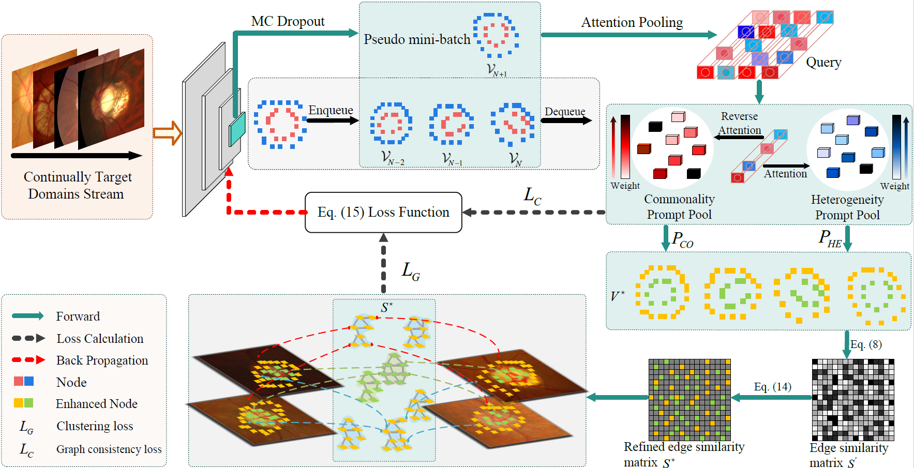

# SPEGC: Continual Test-Time Adaptation via Semantic-Prompt-Enhanced Graph Clustering for Medical Image Segmentation

This is the official PyTorch implementation for the CVPR 2026 accepted paper: 
**"SPEGC: Continual Test-Time Adaptation via Semantic-Prompt-Enhanced Graph Clustering for Medical Image Segmentation"**.



---

## 📢 News
- **[2026.03]** Our paper has been accepted by **CVPR 2026**! 🎉 
- **[2026.03]** The preprint is now available on arXiv: [https://arxiv.org/abs/2603.11492](https://arxiv.org/abs/2603.11492)
- **[2026.06]** Release the source code and weight files.

---

## 🛠️ Installation & Setup

### 1. Requirements
The codebase has been verified on Linux with Python 3.7+, PyTorch 1.9.1+, and CUDA 11.1.

To install the dependencies, run:
```bash
conda create -n spegc python=3.7 -y
conda activate spegc
pip install -r requirements.txt
```

### 2. Detectron2 Installation
This codebase is built on top of Detectron2. Install it via:
```bash
pip install detectron2 -f https://dl.fbaipublicfiles.com/detectron2/wheels/cu111/torch1.9/index.html
```

---

## 📂 Dataset & Pretrained Weights Preparation

To ensure out-of-the-box execution, datasets and weight paths are resolved using relative paths.

### 1. Pretrained Weights
We provide our pre-trained model weights for download on Google Drive: **[Download Pre-trained Weights](https://drive.google.com/drive/folders/1CGViXRjTiS9UCkbp0u2dDLsa4KikBXtu?usp=drive_link)**.

After downloading, place the model weights under the `weights/` directory. For example, for the Fundus configurations, organize them as follows:
```text
weights/
└── fundus_source/
    ├── model_A.pth
    ├── model_B.pth
    ├── model_C.pth
    ├── model_D.pth
    └── model_E.pth
```

### 2. Datasets
Organize your target domain datasets under the `datasets/` directory. Ensure your annotation JSON files and image folders are structured as follows:

```text
datasets/
└── Fundus/
    ├── Drishti_GS/
    ├── ORIGA/
    ├── REFUGE/
    ├── RIM_ONE_r3/
    ├── Drishti_GS_train.json
    ├── Drishti_GS_test.json
    ├── ORIGA_train.json
    ├── ORIGA_test.json
    ├── REFUGE_train.json
    ├── REFUGE_test.json
    ├── REFUGE_Valid.json
    ├── RIM_ONE_r3_train.json
    └── RIM_ONE_r3_test.json
```

---

## 🚀 Running Test-Time Adaptation (Evaluation)

To evaluate the model with test-time training (TTT) on target datasets, use the provided `test.sh` script.

### 1. Configure the Target Domain
Open `test.sh` and set the `MODEL_CONFIG` variable to select your target setting (A/B/C/D/E):
```bash
MODEL_CONFIG="B"  # Options: A, B, C, D, E
```

### 2. Execute TTT & Inference
Run the script from the repository root:
```bash
bash test.sh
```

## 🏋️ Source Model Training

If you want to pre-train the source model on the source domain datasets before running adaptation:

### 1. Configure the Training Script
Open `train.sh` and set your GPU ID and training output directory name:
```bash
CUDA_VISIBLE_DEVICES=0
OUTPUT_NAME="fundus_source"
```

### 2. Run Training
Execute the script from the repository root:
```bash
bash train.sh
```
---

## 📝 Citation

If you find our work helpful for your research, please consider citing our paper:

**Plain Text:**
> Xiaogang Du, Jiawei Zhang, Tongfei Liu, Tao Lei*, Yingbo Wang. SPEGC: Continual Test-Time Adaptation via Semantic-Prompt-Enhanced Graph Clustering for Medical Image Segmentation[C]. IEEE Conference on Computer Vision and Pattern Recognition, Denver, USA, June 3rd-7th, 2026, pp. 8481-8491

**BibTeX:**
```bibtex
@inproceedings{du2026spegc,
  title={SPEGC: Continual Test-Time Adaptation via Semantic-Prompt-Enhanced Graph Clustering for Medical Image Segmentation},
  author={Du, Xiaogang and Zhang, Jiawei and Liu, Tongfei and Lei, Tao and Wang, Yingbo},
  booktitle={IEEE Conference on Computer Vision and Pattern Recognition (CVPR)},
  year={2026},
  address={Denver, USA},
  month={June}
}
```
